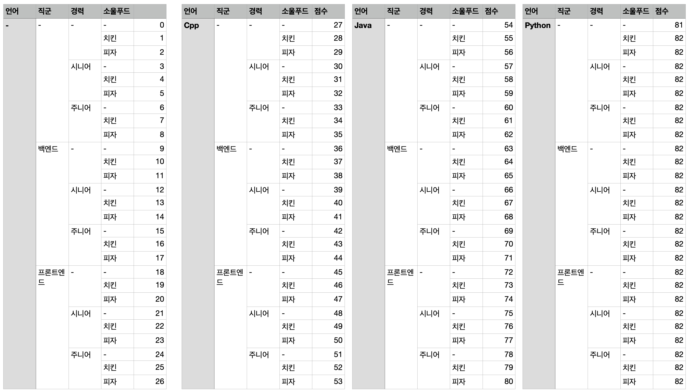

# 순위 검색

다차원 배열을 사용하여 데이터를 미리 aggregate 하고 검색을 할 때 binary search 를 사용하여 검색하는 문제.

[문제 바로가기 링크](https://programmers.co.kr/learn/courses/30/lessons/72412?language=python3)

## 풀이 순서

1. 제시된 정보를 데이터 베이스의 인덱스 처럼 score_list 에 파싱해서 저장한다.
    1. 1차원 배열을 사용하는 방식, 다차원 배열을 사용하는 방식 두 가지 경우로 풀 수 있다.
    2. 1차원 배열을 사용하는 경우
        1. 각 조건 언어 3개, 직군 2개, 경력 2개, 소울 푸드 2개에 아무것도 선택안하는 조건 '-'를 포함하여 배열을 초기화한다.
        2. `(3+1) * (2+1)  * (2+1) * (2+1)`
2. 정보를 조회하여 `score_list`에 담는다.
    1. 순회하며 가능한 인덱스의 부분집합을 구하고 score를 배열에 담는다.
    2. 중복이 일어나 메모리를 더 많이 사용하지만 검색의 효율이 증가된다.
3. `score_list`를 정렬한다.
    2. 바이너리 서치를 하기 위해서는 배열이 정렬이 되어 있어야 한다.
4. 쿼리의 조건을 가지고 `index`를 구한다.
5. binary search 를 활용해 특정 인덱스 이후 갯수(`score`가 더 큰 갯수)를 구한다.

## 재밌었던 점

### 다차원 배열을 1차원 배열로 저장

이차원 배열을 일차원 배열로 나타내기 위해 각 원소별 인덱스를 구해볼 수 있다.

```python
이차원배열 = [
    [1, 2, 3],
    [4, 5, 6],
    [7, 8, 9]
]
일차원배열 = [1, 2, 3, 4, 5, 6, 7, 8, 9]

이차원배열_인덱스 = [(0, 0), (0, 1), (0, 2), (1, 0), (1, 1), (1, 2), (2, 0), (2, 1), (2, 2)]
일차원배열_인덱스 = [0, 1, 2, 3, 4, 5, 6, 7, 8]
```

일차원 배열의 인덱스는 **이차원 배열의 첫번째 원소 * 원소의 갯수 + 이차원 배열의 두번째 원소**로 나타낼 수 있다.

문제에서 언어, 직군, 경력, 소울푸드 각 원소의 갯수가 정해져있기 때문에 위 규칙을 사용해 다차원 배열을 일차원 배열로 나타낼 수 있는 것 이다.

사차원 배열을 일차원 배열로 나타낼 때, 인덱스는 다음과 같이 구할 수 있다.



```python
# java, backend, -, chicken  
사차원_배열_첫번째_인덱스, 사차원_배열_두번째_인덱스, 사차원_배열_세번째_인덱스, 사차원_배열_네번째_인덱스 = (2, 1, 0, 1)

일차원_배열_인덱스 = sum([
    사차원_배열_첫번째_인덱스 * 3 * 3 * 3,  # 언어
    사차원_배열_두번째_인덱스 * 3 * 3,  # 직군
    사차원_배열_세번째_인덱스 * 3,  # 경력
    사차원_배열_네번째_인덱스,  # 소울푸드
])
print(일차원_배열_인덱스)
```
```text
64
```

### 비트연산을 사용한 부분집합 구하기
코드 라인 25에서 부터 시작하는 로직은 비트 연산을 통해 모든 부분 집합을 찾는 로직이다.

```python
for i in range(1<<4):
```
1. 원소가 4개인 집합의 모든 부분 집합의 갯수는 2^4개다.
2. 비트 연산을 사용해서 부분 집합 갯수를 구했기 때문에, 모든 부분 집합을 검사한다고 볼 수 있다.

```python
for j in range(4):
```
1. 원소의 인덱스를 순회하겠다는 것을 의미한다.

```python
if i & (1 << j):
```
1. i(0 ~ 15)를 이진법으로 나타내면 0000, 0001, ..., 1111 되는데 이때 0, 1은 원소 존재여부에 대한 flag다. 
2. 예를 들어 j가 2이고 i가 5일 때. 
   1. i를 이진법으로 표기하면 0101가 되고, i는 부분집합 중 첫번째 원소와 3번째 원소를 포함하는 부분집합을 나타낸다.
   2. `i << j` 는 0100 이고, 이는 j가 위치한 자리에 flag 표기를 하는 것이다.
   3. 이제 둘을 & 연산하면 원소 j가 i 부분집합에 속하는지 알 수 있다.

### 이분 탐색으로 갯수 빠르게 구하기
정렬이 된 경우 빠르게 검색하기 위한 방법으로 이진 탐색을 사용할 수 있다. 
검색의 범위를 반씩 끊어서 검색하는 알고리즘으로 log(N)의 시간 복잡도를 갖는다.

문제에서는 갯수를 요구했는데, 처음엔 배열을 잘라 len을 구하는 방법을 사용했다.
```python
idx = bisect_left(score_list[index], score)
count = len(score_list[index][idx:])
```

파이썬의 이진탐색 알고리즘 bisect_left는 삽입할 수 있는 인덱스를 반환하는데 전체 길이에서 인덱스를 빼는 것으로 같은 결과를 얻을 수 있다.
```python
idx = bisect_left(score_list[index], score)
count = len(score_list[index]) - idx
```