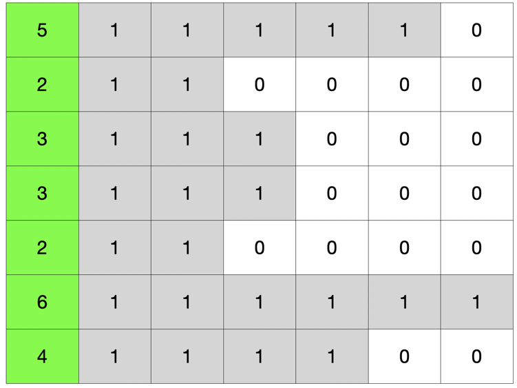
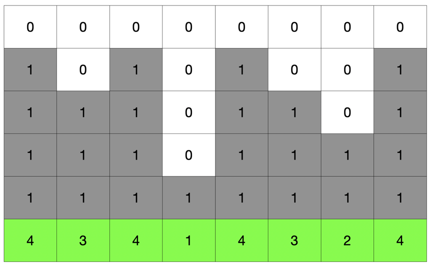

# 야근 지수

n 시간 만큼 일을 더 진행했을 때, 야근의 피로도가 최소가 되는 시간을 구하는 문제였다. 접근 방식은 여러개 있지만, 가장 효율적으로 문제를 풀기 위해서는 **우선순위 큐**를 사용하는 것이 좋다.

[문제 바로가기](https://programmers.co.kr/learn/courses/30/lessons/12927)

## 풀이 순서

1. 남은 작업을 최대 우선순위 큐에 넣는다.
2. 작업이 가장 많이 남은 작업을 꺼낸다.
3. 1시간 만큼 작업을 진행하고 다시 남은 작업에 넣는다.
4. 2번 반복.

## 재밌었던 점

이 문제에 대해서 4가지 방식으로 풀었는데 마지막을 제외하고 모두 효율성에서 실패를 했다.

### 1) 일반 for 문을 사용한 접근

works 에서 가장 많이 남은 작업을 찾기위해 `max`, `index` 등을 사용했다. 내부적으로 탐색을 2번 하기 때문에 효율이 좋지 못했다. 

```python
 for i in range(n):
     works[works.index(max(works))] -= 1
```

### 2) 이차원 배열을 사용한 접근 - 1



1. works 를 위와 같이 이차원 배열로 생성한다.
2. 열을 하나씩 감소하면서 
   1. 1이 있으면 n에서 1을 빼고 배열을 0으로 변경한다.
   2. 0이 있으면 그냥 패스한다.
3. 이중 배열을 각 행을 더해서(**남은 작업량**) 제곱한다.


### 3) 이차원 배열을 사용한 접근 - 2



1. 위 접근 방식에서 행과 열만 변경한다.


### 4) 우선 순위 큐를 사용한 접근

결국 문제의 관건은 일이 가장 많이 남은 작업을 바로 찾아 내는 것이다.

남은 작업량을 가중치라고 두고 최대 우선순위 큐를 사용해서 매순간 가장 많이 남은 작업을 조회하도록 처리하니까 효과적이었다.  

```python
works = [(-w, w) for w in works]

heapq.heapify(works)

for _ in range(n):
    _, work = heapq.heappop(works)
    work -= 1
    heapq.heappush(works, (-work, work))
```