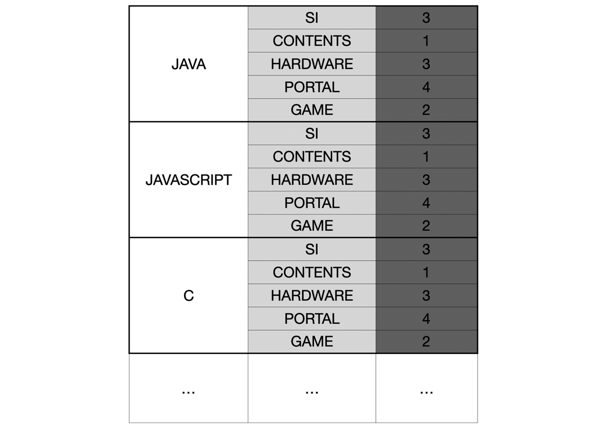

# 직업군 추천하기 

table 로 주어진 데이터를 잘 저장하여 빠른 검색으로 찾아내도록 풀었다.

<b>언어 별 직군에 대한 추천 점수를 저장하도록 설계</b>

[문제 바로가기](https://programmers.co.kr/learn/courses/30/lessons/84325?language=python3)

## 풀이 순서
1. `table`로 주어진 데이터를 `db` 변수에 담는다.
2. 직군별 언어에 대한 추천 점수를 계산한다.
3. 가장 높은 추천 점수를 받는 직군을 반환한다.

## 재밌었던 점

### dict를 사용한 빠른 조회가 가능한 데이터 구조

언어별로 가장 추천하는 직군을 추천해주는 것이 문제가 원하는 것이기 때문에 언어를 가장 상단의 키로 봤다.



이렇게 저장을 하게 되면 언어별 직군의 점수를 바로 가져올 수 있다.
```python
prefer_score = sum(db[lang][job] * p for p, lang in zip(preference, languages))
```